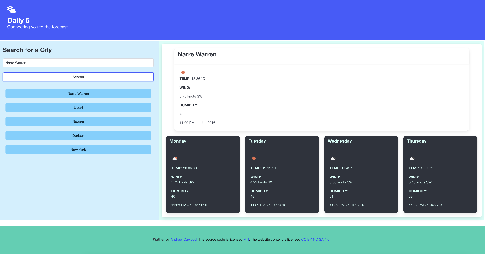

<!-- Improved compatibility of back to top link: See: https://github.com/othneildrew/Best-README-Template/pull/73 -->
<a name="readme-top">

# Daily 5 

## About The Project

GIVEN a weather dashboard with form inputs
WHEN the user searches for a city
THEN They are presented with current and future conditions for that city and that city is added to the search history
WHEN they view current weather conditions for that city
THEN they are presented with the city name, the date, an icon representation of weather conditions, the temperature, the humidity, and the wind speed
WHEN the user views future weather conditions for that city
THEN they are presented with a 5-day forecast that displays the date, an icon representation of weather conditions, the temperature, the wind speed, and the humidity
WHEN they click on a city in the search history
THEN they are presented with current and future conditions for that city

(<a href="#readme-top">back to top</a>)

### Built With

- Javscript with Jquery
  asyncronous fetches happen to the open weather API for weather forecast data.
- Bulma CSS framework 

<!-- GETTING STARTED -->

## Getting Started

Simply upload the source files including assets to a file server. 

##  Prerequisites

### Installation

## Usage

This app can be used to check the weather with open weather api for any city in the world.

<!-- ROADMAP -->

## Roadmap
### the app can be improved with some use of map() or reduce() functions which will change the way data is looped through to get a 5 day forecast from a 3 hour forecast over the span of 5 days.

### the app can be improved by not duplicating the weather cards in html when they can be created once and repeated through Jquery.

<!-- CONTRIBUTING -->

## Contributing

(<a href="#readme-top">back to top</a>)

<!-- LICENSE -->

## License

(<a href="#readme-top">back to top</a>)

<!-- CONTACT -->

## Contact

Andrew Cawood  - cawooda@gmail.com

Project Link: [https://github.com/cawooda/daily-five](https://github.com/cawooda/daily-five)

(<a href="#readme-top">back to top</a>)

<!-- ACKNOWLEDGMENTS -->

## Acknowledgments

(<a href="#readme-top">back to top</a>)

